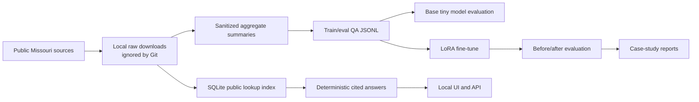

# Missouri Tiny LLM Case Study

A reproducible public case study for building a small local chatbot over Missouri public data.

The project combines two ideas:

- a tiny local language-model experiment using `HuggingFaceTB/SmolLM2-135M-Instruct` with a LoRA adapter
- deterministic lookup over locally indexed Missouri Accountability Portal files and selected aggregate Missouri report files for exact public-record questions

The goal is not to make a general chatbot. The goal is to show a careful, source-backed workflow for basic public-data questions: what data was used, how it was processed, what the model did and did not improve, and where deterministic lookup is the better engineering choice.

This is an independent educational project. It is not endorsed by, operated by, or representative of the State of Missouri.

## What The Finished Project Looks Like

A reviewer can clone this repo and see:

- public-data source documentation
- scripts that estimate download size before pulling data
- a reproducible ingestion and indexing pipeline
- sanitized aggregate QA files that are safe to publish
- a tiny LoRA fine-tuning run with resource measurements
- evaluation reports showing before/after behavior
- a local browser UI and `/api/ask` endpoint for asking questions
- local-only contract metadata lookup with document links and MAP payment context
- capped local contract-document text extraction for simple contract explanations
- exact aggregate DOR lookup for county taxable sales, business locations, vehicle counts, licensed-driver totals, dealer counts, and SIC location counts
- exact MERIC LAUS lookup for Missouri and county unemployment rate, labor force, employment, and unemployed counts
- exact `data.mo.gov` catalog metadata lookup for dataset counts, themes, keyword/title searches, landing pages, and CSV/JSON/PDF distribution links
- exact selected `data.mo.gov` education lookup for high-school senior counts and completed FAFSA application counts by school/year
- exact selected DESE School Directory lookup for district county/MSIP/enrollment, school counts, grade spans, and largest-district rankings
- exact selected `data.mo.gov` public-health lookup for aggregate communicable-disease YTD counts, rates per 100k, 5-year median comparisons, and rankings
- exact selected DHSS WIC aggregate lookup for county and municipality household-row counts, redeemed net-benefit totals, average benefits, and top-county rankings
- exact selected `data.mo.gov` long-term-care lookup for sanitized directory capacity facts and aggregate census occupancy
- exact selected `data.mo.gov` DNR water lookup for public drinking-water system counts, PWSID lookups, and county rankings
- exact selected `data.mo.gov` utility lookup for city/county electric, gas, water, and telephone providers
- exact selected `data.mo.gov` agriculture lookup for feed sample IDs, feed class counts/rankings, and nutrient guarantee/result values
- source-page index and expansion preflight for 18 Missouri public-data families, including data.mo.gov, DESE, DHSS, MSHP, MERIC, DNR, MSDIS, MoDOT, Auditor, DOR, MEC, SOS elections, OA Budget, child care, long-term care, PSC, cannabis, and agriculture sources
- guardrails for unsupported questions, private identifiers, broad data dumps, and reversed payment-direction prompts

The useful end state is a local chatbot that can answer tightly scoped questions such as:

```text
How much did TRANSPORTATION pay BOKF NA in 2025?
What tax credit amount was issued to CARTWRIGHT HOLDINGS in fiscal year twenty twenty six?
What are the top 10 agencies in 2026?
Which Missouri employee gets paid the most?
How many licensed hospital beds are in the processed hospital profile source?
Who is the governor of Missouri?
Find contract CC221256001 and show its document links.
Explain contract CC221256001 in simple terms.
What were Boone County taxable sales in 2025?
How many licensed drivers are in Boone County?
What is Boone County unemployment rate in March 2026?
Which county had the highest unemployment rate in March 2026?
Which data.mo.gov datasets mention hospital?
What are the top data.mo.gov catalog themes?
How many high school seniors are listed for Rock Bridge Sr. High in 2026?
How many completed FAFSA applications did Rock Bridge Sr. High report in 2026?
What county is Columbia 93 in?
What grade span is Rock Bridge Sr. High?
Which Missouri school district has the largest enrollment in the DESE directory?
How many anaplasmosis cases are listed YTD in the Missouri communicable disease report?
Which disease has the highest current week YTD count?
How many WIC household rows are listed for Boone County?
Which county had the highest WIC benefit total?
How many LTC directory rows are listed for Boone County?
What is the statewide LTC census occupancy ratio?
How many public water systems are listed in Boone County?
What is the PWSID for City of Columbia Utilities?
What utilities serve Columbia in Boone County?
Which electric utility appears most often?
What are the protein values for sample D202500550?
How many Poultry Feed samples are indexed?
```

For exact Missouri Accountability Portal facts, answers come from a local SQLite index with citations. Current Missouri civic facts are handled as a small sourced fact layer rather than unsupported model memory. The tiny model is used for simple retrieved QA and the learning case study, not as a database of memorized public records.

## Current Result

| Area | Result |
| --- | --- |
| MAP inventory | 107 public download targets identified |
| MAP local index | 104 text files indexed |
| MAP parsed rows | 6,123,427 |
| Lookup tables | expenditure, employee, agency-vendor, tax credit, federal grant, budget restriction, bond, stimulus, check cancellation |
| Local index size | about 1.15 GB, intentionally not committed |
| Run 002 training data | 304 train rows, 40 eval rows |
| Tiny model | `HuggingFaceTB/SmolLM2-135M-Instruct` |
| Fine-tuning method | LoRA adapter |
| Run 002 runtime | about 55 seconds |
| Peak allocated VRAM | 619.14 MB on an RTX 3060 Ti |
| Adapter size | about 5.1 MB, intentionally not committed |
| Stronger run 003 model | `Qwen/Qwen2.5-1.5B-Instruct` |
| Run 003 runtime | about 322 seconds |
| Run 003 peak VRAM | 3,811.43 MB |
| Run 003 adapter size | about 15.1 MB, intentionally not committed |
| Contract index | 991 public contract rows found; first 200 detail pages indexed locally |
| Contract document text index | 12 public PDFs, 4.29 MB downloaded locally in the sample capped run |
| data.mo.gov catalog preflight | 277 datasets found; 272 with distributions |
| data.mo.gov catalog index | 277 dataset metadata records; 255 CSV and 255 JSON distribution links; 395 KB source snapshot |
| data.mo.gov education index | 2 public education datasets, 14,123 parsed school/year rows |
| DESE School Directory index | 489 district rows, 2,433 school/building rows, 3.4 MB public PDF snapshot |
| data.mo.gov health index | 1 public aggregate health dataset, 52 disease/condition rows |
| DHSS WIC aggregate index | 86,044 public source household rows summarized into 115 county and 224 municipality aggregate rows |
| data.mo.gov LTC index | 1,101 sanitized directory rows, 986 unique facility numbers, 47 aggregate census rows |
| data.mo.gov DNR water index | 1 public drinking-water dataset, 1,425 system rows |
| data.mo.gov utility index | 1 public utility-provider dataset, 1,718 city/county rows |
| data.mo.gov agriculture index | 1 public feed sample testing dataset, 8,388 rows |
| Public source index | 18 source families checked; 18 connected |
| MSHP crash aggregate index | 9 official Excel files, 540 metric-year records |
| DOR aggregate report index | 7 official public report files, 38,451 aggregate records |
| MERIC LAUS labor index | 25 official CSV downloads, 353 aggregate rows, 115 county areas |
| Expansion preflight | Contracts, data.mo.gov, DESE, DHSS, MSHP, MERIC, DNR, MSDIS, MoDOT, Auditor, DOR, MEC, SOS, OA Budget, child care, long-term care, PSC, cannabis, and agriculture source pages checked |
| Behavior tests | 110 chatbot cases passed |

The first headline before/after comparison was intentionally preserved even though it was not a clean win: the base model scored 18 / 20 and the fine-tuned adapter also scored 18 / 20. The more useful architecture became clear from that result: keep exact public facts in deterministic lookup, and use the model for small retrieved QA and explanation.

Run 003 adds a stronger local instruction model path. `Qwen/Qwen2.5-1.5B-Instruct` was fine-tuned with LoRA on the expanded Missouri QA set and can be used as an opt-in grounded answer synthesizer. Gemma 3 1B is also configured, but it requires accepting Google's gated Hugging Face terms and logging in before download or fine-tuning.

## Data Used

| Source | What was used | How it is used |
| --- | --- | --- |
| [Missouri Accountability Portal download page](https://mapyourtaxes.mo.gov/MAP/Download/) | Expenditures, employees, tax credits, federal grants, budget restrictions, bonds, stimulus, check cancellations | Raw public files are downloaded locally, indexed into SQLite, and excluded from Git |
| [MissouriBUYS Contract Board](https://missouribuys.mo.gov/contractboard) and [OA Contract Search](https://archive.oa.mo.gov/purch/contracts/) | Contract numbers, contractors, descriptions, detail pages, document URLs, capped PDF text extraction | Metadata is indexed locally; contract PDFs can be downloaded/extracted locally with size limits |
| [data.mo.gov catalog](https://data.mo.gov/data.json) | Statewide Socrata/DCAT dataset metadata | Indexed locally for cited catalog counts, themes, dataset search, landing pages, and distribution links |
| [data.mo.gov Total Number of High School Seniors](https://data.mo.gov/d/8yaf-xv66) and [Completed FAFSAs Reported to MDHE](https://data.mo.gov/d/t9f4-ncza) | School/year education rows | Indexed locally for cited high-school senior counts, completed FAFSA application counts, suppression-aware values, and top-school rankings |
| [DESE School Directory](https://dese.mo.gov/data-system-management/directory) and [School Directory Data Downloads](https://dese.mo.gov/school-directory/data-downloads) | Public School Directory by District PDF | Indexed locally for cited district county, MSIP, enrollment, school/building counts, school code, and grade-span lookup |
| [data.mo.gov Missouri Communicable Disease Report (2026)](https://data.mo.gov/d/fk75-fa28) | Aggregate disease/condition rows | Indexed locally for cited current-week YTD counts, previous-week YTD counts, 5-year median comparisons, rates per 100k, and rankings |
| [DHSS WIC Data](https://data.mo.gov/d/diyi-fr2a) | Public WIC household source rows for SFY 2025 | Queried through aggregate Socrata routes only; indexed locally for cited county and municipality household-row counts, redeemed net-benefit totals, average benefits, and rankings |
| [data.mo.gov LTC Directory](https://data.mo.gov/d/fenu-sipv) and [LTC Census Report](https://data.mo.gov/d/bf8b-a47t) | Public long-term-care directory and aggregate census rows | Indexed locally for cited county/city/facility capacity facts, level-of-care summaries, top-county capacity ranking, and statewide occupancy; contact/person/address fields are not stored or returned |
| [data.mo.gov Consumer Confidence Report](https://data.mo.gov/d/3mwf-kse4) | Public drinking-water system rows | Indexed locally for cited county water-system counts, PWSID lookup, system-name lookup, and county rankings |
| [data.mo.gov Find A Missouri Utility](https://data.mo.gov/d/yeiz-h2m2) | City/county utility-provider rows | Indexed locally for cited electric, gas, water, and telephone provider lookup plus provider rankings |
| [data.mo.gov Missouri Department of Agriculture feed sample testing results](https://data.mo.gov/d/y9w9-qkg2) | Public feed sample testing rows | Indexed locally for cited sample ID lookup, feed class counts/rankings, and selected nutrient guarantee/result values |
| [Official Missouri Governor site](https://governor.mo.gov/) | Current governor fact snapshot | Curated civic-fact fallback with source citation |
| [data.mo.gov Profile of Hospitals](https://data.mo.gov/resource/q8me-hzr8.json) | Hospital aggregate fields | Processed into sanitized aggregate QA |
| [DESE School Data](https://dese.mo.gov/school-data) | Education accountability, assessment, staff, finance, and broader school-data registry | Source-indexed for discovery; exact answers currently use the selected School Directory PDF and selected data.mo.gov education tables |
| [DHSS Data](https://health.mo.gov/data/) | County profiles, births/deaths, hospitalizations, BRFSS source registry | Preflighted with privacy-first aggregate-data policy |
| [MSHP SAC Data](https://www.mshp.dps.mo.gov/MSHPWeb/SAC/data_960grid.html) | Aggregate crash severity, rates, circumstances, and factor Excel files | Indexed locally for cited crash-statistic lookup |
| [MERIC LAUS unemployment data](https://meric.mo.gov/data/economic/local-area-unemployment-statistics/laus) | Missouri and county unemployment rate, labor force, employment, and unemployed counts for the current indexed release year | Indexed locally for cited labor-market lookup; the broader MERIC source page remains cataloged for wages, projections, and regional profiles |
| [Missouri DNR Data and e-Services](https://dnr.mo.gov/data-e-services) | Environmental and water data source registry | Preflighted for future environmental answers |
| [MSDIS](https://www.msdis.missouri.edu/) | Missouri geospatial source registry | Preflighted with metadata/vector-first policy |
| [MoDOT traffic data](https://www.modot.org/modatazone/traffic) | Traffic counts, traffic volume maps, safety, road/route source registry | Source-indexed for transportation questions |
| [Missouri State Auditor reports](https://auditor.mo.gov/AuditReport/Menu) | Audit reports and local government accountability report registry | Source-indexed for audit and accountability questions |
| [DOR public reports](https://dor.mo.gov/public-reports/) | 2025 county taxable sales, 2016 business-location report, vehicle counts, licensed-driver totals, dealer counts, and SIC location reports | Indexed locally for cited aggregate revenue, vehicle, driver, dealer, and SIC lookup |
| [Missouri Ethics Commission](https://mec.mo.gov/) | Campaign finance, lobbying, committee, commission-action, and annual-report registry | Source-indexed for ethics and political-finance questions |
| [Secretary of State elections](https://www.sos.mo.gov/elections/s_default) | Election results, candidates, ballot measures, voter-turnout, and calendar source registry | Source-indexed for election-data questions |
| [OA Budget and Planning](https://oa.mo.gov/budget-and-planning) | Budget, revenue, performance-measure, demographics, and redistricting source registry | Source-indexed for budget-context questions |
| [DESE child care dashboards](https://dese.mo.gov/childhood/child-care/child-care-data-dashboards) | Child care facilities, slots, inspections, complaints, and licensing dashboard registry | Source-indexed for child-care source questions |
| [DHSS long-term care inspections](https://health.mo.gov/safety/nursinghomesinspected/index.php) | Nursing home and long-term-care inspection source registry | Source-indexed for facility-inspection source questions |
| [Public Service Commission reports](https://psc.mo.gov/General/PSC_Reports) | Utility report and regulation source registry | Source-indexed for utility-regulation source questions |
| [DHSS Cannabis Regulation](https://health.mo.gov/safety/cannabis/) | Cannabis annual report, facility, dashboard, sales, and regulatory source registry | Source-indexed for cannabis-regulation source questions |
| [Agricultural Market News](https://agmarketnews.mo.gov/reports/) | Livestock, cattle, swine, sheep/goat, and regional market-report source registry | Source-indexed for agriculture source questions |

The public repo includes small generated summaries and QA files. It does not include raw MAP downloads, the SQLite lookup index, local model caches, or LoRA checkpoints.

Important data handling choices:

- Raw MAP files stay under `data/raw_public/`, which is ignored by Git.
- The SQLite lookup index stays at `data/raw_public/map_public_lookup.sqlite`, also ignored by Git.
- The contract metadata index stays under `data/raw_public/contracts/`, also ignored by Git.
- The contract document index and downloaded PDFs stay under `data/raw_public/contracts/`, also ignored by Git.
- The DOR aggregate report index stays under `data/raw_public/dor_reports/`, also ignored by Git; the public repo includes only the compact build report.
- The MERIC LAUS labor index stays under `data/raw_public/meric_labor/`, also ignored by Git; the public repo includes only the compact build report.
- The data.mo.gov catalog index stays under `data/raw_public/data_mo_catalog/`, also ignored by Git; the public repo includes only the compact build report.
- The selected data.mo.gov education index stays under `data/raw_public/data_mo_education/`, also ignored by Git; the public repo includes only the compact build report.
- The selected DESE School Directory index stays under `data/raw_public/dese_directory/`, also ignored by Git; the public repo includes only the compact build report.
- The selected data.mo.gov public-health index stays under `data/raw_public/data_mo_health/`, also ignored by Git; the public repo includes only the compact build report.
- The selected DHSS WIC aggregate index stays under `data/raw_public/data_mo_wic/`, also ignored by Git; the public repo includes only the compact build report. It stores aggregate county/municipality rows, not raw household rows.
- The selected data.mo.gov LTC index stays under `data/raw_public/data_mo_ltc/`, also ignored by Git; the public repo includes only the compact build report. It stores sanitized facility directory fields and aggregate census rows, not administrator, phone, mailing, or street-address fields.
- The selected data.mo.gov DNR water index stays under `data/raw_public/data_mo_water/`, also ignored by Git; the public repo includes only the compact build report.
- The selected data.mo.gov utility index stays under `data/raw_public/data_mo_utility/`, also ignored by Git; the public repo includes only the compact build report.
- The selected data.mo.gov agriculture index stays under `data/raw_public/data_mo_agriculture/`, also ignored by Git; the public repo includes only the compact build report.
- Employee pay lookup is allowed only through deterministic public lookup, because MAP employee records are public. The UI suppresses raw employee row previews.
- Dealer reports are summarized by county and dealer type only; the chatbot does not emit dealer addresses or phone numbers from the source file.
- Training examples avoid named-person salary memorization and raw row reproduction.
- The tax-credit index skips `TC_2000-Current.txt` when annual tax-credit files are indexed, which prevents duplicate annual totals.

## Methods

This project follows a small, practical version of a Karpathy-style learning loop: build the simplest baseline, measure it, make one change, evaluate again, and publish the failure modes.



Key methods:

- **Preflight constraints**: estimate download size, disk use, RAM, VRAM, and expected runtime before heavy steps.
- **Public-data ingestion**: download reproducible public sources and keep raw files local.
- **Sanitized QA generation**: create small aggregate/source QA sets for training and evaluation.
- **Baseline first**: run the tiny base model before training.
- **LoRA fine-tuning**: train a small adapter instead of full model weights.
- **Deterministic lookup**: answer exact MAP facts with SQLite queries and citations.
- **Guardrails**: refuse private identifiers, unsupported datasets, full-table dumps, forecasts, and unsupported payment direction.
- **Regression tests**: test adversarial and tricky prompts after behavior changes.

## Why It Is Useful

This repo is useful as a public portfolio case study because it demonstrates the parts of applied AI that are easy to skip:

- choosing a narrow scope instead of pretending a tiny model is ChatGPT
- separating model behavior from deterministic data lookup
- documenting public-data boundaries
- measuring local hardware constraints before training
- preserving negative results instead of overstating model improvement
- building a small UI that shows citations and source support

It can answer basic public-record questions from the indexed local MAP snapshot, but it is not a production public-finance assistant.

## Hardware And Storage Expectations

Observed local development machine:

- CPU: Intel Core i5-12600K
- RAM: about 32 GB
- GPU: NVIDIA GeForce RTX 3060 Ti with 8 GB VRAM
- Peak observed training VRAM: about 619 MB

Approximate storage:

- MAP public downloads: about 589 MB
- MAP SQLite lookup index: about 1.15 GB
- DOR source report downloads: about 5.8 MB; local parsed DOR JSON index: about 20 MB
- MERIC LAUS CSV downloads and local JSON index: about 0.31 MB
- data.mo.gov catalog metadata snapshot and local JSON index: less than 2 MB
- selected data.mo.gov education snapshots and local JSON index: about 5 MB
- selected DESE School Directory PDF and local JSON index: about 4.6 MB
- selected data.mo.gov public-health snapshot and local JSON index: less than 1 MB
- selected DHSS WIC aggregate queries and local JSON index: less than 1 MB
- selected data.mo.gov LTC directory/census snapshot and local JSON index: less than 2 MB
- selected data.mo.gov DNR water snapshot and local JSON index: less than 1 MB
- selected data.mo.gov utility snapshot and local JSON index: less than 1 MB
- selected data.mo.gov agriculture feed sample snapshot and local JSON index: about 18 MB
- first Hugging Face model cache: about 300 to 500 MB
- LoRA adapter: about 5 MB

Have at least 5 GB free before running the full pipeline. The scripts are intentionally capped so this should not stress a desktop GPU.

## Quickstart

Windows PowerShell:

```powershell
git clone https://github.com/Stroudmj00/missouri-tiny-llm-case-study.git
cd missouri-tiny-llm-case-study

py -3.11 -m venv .venv
.\.venv\Scripts\python -m pip install --upgrade pip
.\.venv\Scripts\python -m pip install -r requirements.txt
```

If you do not have a CUDA-enabled NVIDIA GPU, use the official PyTorch install selector and adjust `requirements.txt` before installing.

Run environment and artifact checks:

```powershell
.\.venv\Scripts\python scripts\check_environment.py
.\.venv\Scripts\python scripts\verify_project.py
```

Build the small sanitized public-data artifacts:

```powershell
.\.venv\Scripts\python scripts\build_public_dataset.py --target-count 120
```

Build the public source-page index used for source-discovery answers:

```powershell
.\.venv\Scripts\python scripts\build_public_source_index.py --force
.\.venv\Scripts\python scripts\preflight_data_expansion.py
```

Build the data.mo.gov catalog metadata index:

```powershell
.\.venv\Scripts\python scripts\build_data_mo_catalog_index.py --force
```

Build the selected data.mo.gov education index:

```powershell
.\.venv\Scripts\python scripts\build_data_mo_education_index.py --force
```

Build the selected DESE School Directory exact lookup index:

```powershell
.\.venv\Scripts\python scripts\build_dese_directory_index.py --force
```

Build the selected data.mo.gov public-health, LTC, DNR water, utility, and agriculture indexes:

```powershell
.\.venv\Scripts\python scripts\build_data_mo_health_index.py --force
.\.venv\Scripts\python scripts\build_data_mo_wic_index.py --force
.\.venv\Scripts\python scripts\build_data_mo_ltc_index.py --force
.\.venv\Scripts\python scripts\build_data_mo_water_index.py --force
.\.venv\Scripts\python scripts\build_data_mo_utility_index.py --force
.\.venv\Scripts\python scripts\build_data_mo_agriculture_index.py --force
```

Build the small MSHP aggregate crash-statistics index:

```powershell
.\.venv\Scripts\python scripts\build_mshp_crash_index.py --force
```

Build the DOR aggregate public-reports index:

```powershell
.\.venv\Scripts\python scripts\build_dor_reports_index.py --force
```

Build the MERIC LAUS labor-market index:

```powershell
.\.venv\Scripts\python scripts\build_meric_labor_index.py --force
```

Download and index all currently listed MAP public files:

```powershell
.\.venv\Scripts\python scripts\download_map_all.py --download
.\.venv\Scripts\python scripts\build_map_public_index.py --rebuild
.\.venv\Scripts\python scripts\build_map_training_data.py
```

Start the local UI:

```powershell
.\.venv\Scripts\python scripts\serve_ui.py --port 7860
```

Then open `http://127.0.0.1:7860/`.

Start the stronger grounded-synthesis UI after training run 003:

```powershell
.\.venv\Scripts\python scripts\serve_ui.py `
  --port 7860 `
  --model-id Qwen/Qwen2.5-1.5B-Instruct `
  --adapter-path checkpoints/qwen2_5_1_5b_lora_run_003 `
  --synthesis local `
  --synthesis-max-new-tokens 160
```

## Useful Commands

Ask one question from the command line:

```powershell
.\.venv\Scripts\python scripts\ask_model.py "How much did TRANSPORTATION pay BOKF NA in 2025?"
```

Run chatbot behavior checks after building the MAP index:

```powershell
.\.venv\Scripts\python scripts\test_chatbot_behavior.py
```

Run the capped baseline:

```powershell
.\.venv\Scripts\python scripts\run_baseline.py --max-prompts 6 --max-new-tokens 48
```

Run a LoRA fine-tune:

```powershell
.\.venv\Scripts\python scripts\finetune_lora.py --config configs\finetune_smollm2_135m_lora_run_002.yaml
```

Run the stronger accessible LoRA fine-tune:

```powershell
.\.venv\Scripts\python scripts\finetune_lora.py --config configs\finetune_qwen2_5_1_5b_lora_run_003.yaml
```

Compare base and fine-tuned outputs:

```powershell
.\.venv\Scripts\python scripts\evaluate_comparison.py --max-prompts 20 --max-new-tokens 48
```

## Repository Structure

```text
configs/                 LoRA training configs
data/processed/          sanitized aggregate summaries safe to publish
data/qa/                 generated train/eval QA JSONL
data/eval/               fixed evaluation prompts
data/raw_public/         local-only public downloads and SQLite index, ignored by Git
docs/                    case study, data card, model card, safety notes, roadmap
reports/                 reproducibility reports, metrics, behavior checks
scripts/                 command wrappers
src/missouri_tiny_llm/   ingestion, indexing, training, evaluation, chatbot, UI
```

## Reports To Read First

- [Case study](docs/CASE_STUDY.md)
- [Data card](docs/DATA_CARD.md)
- [Data safety rules](docs/DATA_SAFETY.md)
- [Model card](docs/MODEL_CARD.md)
- [Powerful chatbot upgrade](docs/POWERFUL_CHATBOT_UPGRADE.md)
- [Evaluation notes](docs/EVALUATION.md)
- [Limitations](docs/LIMITATIONS.md)
- [Hypothetical question probe](reports/hypothetical_question_probe.md)
- [Chatbot upgrade notes](reports/chatbot_capability_upgrade.md)
- [Command log](reports/command_log.md)

## Limitations

- The model is tiny and should not be compared to frontier chat models.
- Exact public-record answers require the local MAP index to exist.
- The matching layer is heuristic, not a full search engine.
- The current reports are from one local machine and one public-data snapshot.
- This is not legal, procurement, financial, employment, or policy advice.
- This is not an official State of Missouri product.

## License

MIT. See [LICENSE](LICENSE).
