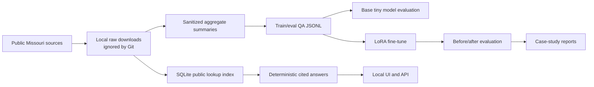

# Missouri Tiny LLM Case Study

A reproducible public case study for building a small local chatbot over Missouri public data.

The project combines two ideas:

- a tiny local language-model experiment using `HuggingFaceTB/SmolLM2-135M-Instruct` with a LoRA adapter
- deterministic lookup over locally indexed Missouri Accountability Portal files for exact public-record questions

The goal is not to make a general chatbot. The goal is to show a careful, source-backed workflow for basic public-data questions: what data was used, how it was processed, what the model did and did not improve, and where deterministic lookup is the better engineering choice.

This is an independent educational project. It is not endorsed by, operated by, or representative of the State of Missouri.

## What The Finished Project Looks Like

A reviewer can clone this repo and see:

- public-data source documentation
- scripts that estimate download size before pulling data
- a reproducible ingestion and indexing pipeline
- sanitized aggregate QA files that are safe to publish
- a tiny LoRA fine-tuning run with resource measurements
- evaluation reports showing before/after behavior
- a local browser UI and `/api/ask` endpoint for asking questions
- local-only contract metadata lookup with document links and MAP payment context
- capped local contract-document text extraction for simple contract explanations
- expansion preflight for data.mo.gov, DESE education, DHSS public health, MSHP traffic safety, MERIC labor, DNR environment, and MSDIS geospatial sources
- guardrails for unsupported questions, private identifiers, broad data dumps, and reversed payment-direction prompts

The useful end state is a local chatbot that can answer tightly scoped questions such as:

```text
How much did TRANSPORTATION pay BOKF NA in 2025?
What tax credit amount was issued to CARTWRIGHT HOLDINGS in fiscal year twenty twenty six?
What are the top 10 agencies in 2026?
How many licensed hospital beds are in the processed hospital profile source?
Who is the governor of Missouri?
Find contract CC221256001 and show its document links.
Explain contract CC221256001 in simple terms.
```

For exact Missouri Accountability Portal facts, answers come from a local SQLite index with citations. Current Missouri civic facts are handled as a small sourced fact layer rather than unsupported model memory. The tiny model is used for simple retrieved QA and the learning case study, not as a database of memorized public records.

## Current Result

| Area | Result |
| --- | --- |
| MAP inventory | 107 public download targets identified |
| MAP local index | 104 text files indexed |
| MAP parsed rows | 6,123,427 |
| Lookup tables | expenditure, employee, agency-vendor, tax credit, federal grant, budget restriction, bond, stimulus, check cancellation |
| Local index size | about 1.15 GB, intentionally not committed |
| Run 002 training data | 304 train rows, 40 eval rows |
| Tiny model | `HuggingFaceTB/SmolLM2-135M-Instruct` |
| Fine-tuning method | LoRA adapter |
| Run 002 runtime | about 55 seconds |
| Peak allocated VRAM | 619.14 MB on an RTX 3060 Ti |
| Adapter size | about 5.1 MB, intentionally not committed |
| Stronger run 003 model | `Qwen/Qwen2.5-1.5B-Instruct` |
| Run 003 runtime | about 322 seconds |
| Run 003 peak VRAM | 3,811.43 MB |
| Run 003 adapter size | about 15.1 MB, intentionally not committed |
| Contract index | 991 public contract rows found; first 200 detail pages indexed locally |
| Contract document text index | 12 public PDFs, 4.29 MB downloaded locally in the sample capped run |
| data.mo.gov catalog preflight | 277 datasets found; 272 with distributions |
| Expansion preflight | Contracts, data.mo.gov, DESE, DHSS, MSHP, MERIC, DNR, MSDIS, and SOS source pages checked |
| Behavior tests | 30 chatbot cases passed |

The first headline before/after comparison was intentionally preserved even though it was not a clean win: the base model scored 18 / 20 and the fine-tuned adapter also scored 18 / 20. The more useful architecture became clear from that result: keep exact public facts in deterministic lookup, and use the model for small retrieved QA and explanation.

Run 003 adds a stronger local instruction model path. `Qwen/Qwen2.5-1.5B-Instruct` was fine-tuned with LoRA on the expanded Missouri QA set and can be used as an opt-in grounded answer synthesizer. Gemma 3 1B is also configured, but it requires accepting Google's gated Hugging Face terms and logging in before download or fine-tuning.

## Data Used

| Source | What was used | How it is used |
| --- | --- | --- |
| [Missouri Accountability Portal download page](https://mapyourtaxes.mo.gov/MAP/Download/) | Expenditures, employees, tax credits, federal grants, budget restrictions, bonds, stimulus, check cancellations | Raw public files are downloaded locally, indexed into SQLite, and excluded from Git |
| [MissouriBUYS Contract Board](https://missouribuys.mo.gov/contractboard) and [OA Contract Search](https://archive.oa.mo.gov/purch/contracts/) | Contract numbers, contractors, descriptions, detail pages, document URLs, capped PDF text extraction | Metadata is indexed locally; contract PDFs can be downloaded/extracted locally with size limits |
| [data.mo.gov catalog](https://data.mo.gov/data.json) | Statewide Socrata/DCAT dataset metadata | Preflighted as the discovery layer for future public datasets |
| [Official Missouri Governor site](https://governor.mo.gov/) | Current governor fact snapshot | Curated civic-fact fallback with source citation |
| [data.mo.gov Profile of Hospitals](https://data.mo.gov/resource/q8me-hzr8.json) | Hospital aggregate fields | Processed into sanitized aggregate QA |
| [data.mo.gov LTC Census Report](https://data.mo.gov/resource/bf8b-a47t.json) | Long-term-care census aggregate fields | Processed into sanitized aggregate QA |
| [DESE School Data](https://dese.mo.gov/school-data) | Education accountability, assessment, staff, finance, and directory source registry | Preflighted for a later controlled ingestion phase |
| [DHSS Data](https://health.mo.gov/data/) | County profiles, births/deaths, hospitalizations, BRFSS source registry | Preflighted with privacy-first aggregate-data policy |
| [MSHP SAC Data](https://www.mshp.dps.mo.gov/MSHPWeb/SAC/data_960grid.html) | Aggregate crash severity, rates, circumstances, and factor Excel files | Preflighted as a low-size traffic-safety expansion target |
| [MERIC unemployment data](https://meric.mo.gov/data/unemployment) | Labor and unemployment source registry | Preflighted for future labor-market answers |
| [Missouri DNR Data and e-Services](https://dnr.mo.gov/data-e-services) | Environmental and water data source registry | Preflighted for future environmental answers |
| [MSDIS](https://www.msdis.missouri.edu/) | Missouri geospatial source registry | Preflighted with metadata/vector-first policy |

The public repo includes small generated summaries and QA files. It does not include raw MAP downloads, the SQLite lookup index, local model caches, or LoRA checkpoints.

Important data handling choices:

- Raw MAP files stay under `data/raw_public/`, which is ignored by Git.
- The SQLite lookup index stays at `data/raw_public/map_public_lookup.sqlite`, also ignored by Git.
- The contract metadata index stays under `data/raw_public/contracts/`, also ignored by Git.
- The contract document index and downloaded PDFs stay under `data/raw_public/contracts/`, also ignored by Git.
- Employee pay lookup is allowed only through deterministic public lookup, because MAP employee records are public. The UI suppresses raw employee row previews.
- Training examples avoid named-person salary memorization and raw row reproduction.
- The tax-credit index skips `TC_2000-Current.txt` when annual tax-credit files are indexed, which prevents duplicate annual totals.

## Methods

This project follows a small, practical version of a Karpathy-style learning loop: build the simplest baseline, measure it, make one change, evaluate again, and publish the failure modes.



Key methods:

- **Preflight constraints**: estimate download size, disk use, RAM, VRAM, and expected runtime before heavy steps.
- **Public-data ingestion**: download reproducible public sources and keep raw files local.
- **Sanitized QA generation**: create small aggregate/source QA sets for training and evaluation.
- **Baseline first**: run the tiny base model before training.
- **LoRA fine-tuning**: train a small adapter instead of full model weights.
- **Deterministic lookup**: answer exact MAP facts with SQLite queries and citations.
- **Guardrails**: refuse private identifiers, unsupported datasets, full-table dumps, forecasts, and unsupported payment direction.
- **Regression tests**: test adversarial and tricky prompts after behavior changes.

## Why It Is Useful

This repo is useful as a public portfolio case study because it demonstrates the parts of applied AI that are easy to skip:

- choosing a narrow scope instead of pretending a tiny model is ChatGPT
- separating model behavior from deterministic data lookup
- documenting public-data boundaries
- measuring local hardware constraints before training
- preserving negative results instead of overstating model improvement
- building a small UI that shows citations and source support

It can answer basic public-record questions from the indexed local MAP snapshot, but it is not a production public-finance assistant.

## Hardware And Storage Expectations

Observed local development machine:

- CPU: Intel Core i5-12600K
- RAM: about 32 GB
- GPU: NVIDIA GeForce RTX 3060 Ti with 8 GB VRAM
- Peak observed training VRAM: about 619 MB

Approximate storage:

- MAP public downloads: about 589 MB
- MAP SQLite lookup index: about 1.15 GB
- first Hugging Face model cache: about 300 to 500 MB
- LoRA adapter: about 5 MB

Have at least 5 GB free before running the full pipeline. The scripts are intentionally capped so this should not stress a desktop GPU.

## Quickstart

Windows PowerShell:

```powershell
git clone https://github.com/Stroudmj00/missouri-tiny-llm-case-study.git
cd missouri-tiny-llm-case-study

py -3.11 -m venv .venv
.\.venv\Scripts\python -m pip install --upgrade pip
.\.venv\Scripts\python -m pip install -r requirements.txt
```

If you do not have a CUDA-enabled NVIDIA GPU, use the official PyTorch install selector and adjust `requirements.txt` before installing.

Run environment and artifact checks:

```powershell
.\.venv\Scripts\python scripts\check_environment.py
.\.venv\Scripts\python scripts\verify_project.py
```

Build the small sanitized public-data artifacts:

```powershell
.\.venv\Scripts\python scripts\build_public_dataset.py --target-count 120
```

Download and index all currently listed MAP public files:

```powershell
.\.venv\Scripts\python scripts\download_map_all.py --download
.\.venv\Scripts\python scripts\build_map_public_index.py --rebuild
.\.venv\Scripts\python scripts\build_map_training_data.py
```

Start the local UI:

```powershell
.\.venv\Scripts\python scripts\serve_ui.py --port 7860
```

Then open `http://127.0.0.1:7860/`.

Start the stronger grounded-synthesis UI after training run 003:

```powershell
.\.venv\Scripts\python scripts\serve_ui.py `
  --port 7860 `
  --model-id Qwen/Qwen2.5-1.5B-Instruct `
  --adapter-path checkpoints/qwen2_5_1_5b_lora_run_003 `
  --synthesis local `
  --synthesis-max-new-tokens 160
```

## Useful Commands

Ask one question from the command line:

```powershell
.\.venv\Scripts\python scripts\ask_model.py "How much did TRANSPORTATION pay BOKF NA in 2025?"
```

Run chatbot behavior checks after building the MAP index:

```powershell
.\.venv\Scripts\python scripts\test_chatbot_behavior.py
```

Run the capped baseline:

```powershell
.\.venv\Scripts\python scripts\run_baseline.py --max-prompts 6 --max-new-tokens 48
```

Run a LoRA fine-tune:

```powershell
.\.venv\Scripts\python scripts\finetune_lora.py --config configs\finetune_smollm2_135m_lora_run_002.yaml
```

Run the stronger accessible LoRA fine-tune:

```powershell
.\.venv\Scripts\python scripts\finetune_lora.py --config configs\finetune_qwen2_5_1_5b_lora_run_003.yaml
```

Compare base and fine-tuned outputs:

```powershell
.\.venv\Scripts\python scripts\evaluate_comparison.py --max-prompts 20 --max-new-tokens 48
```

## Repository Structure

```text
configs/                 LoRA training configs
data/processed/          sanitized aggregate summaries safe to publish
data/qa/                 generated train/eval QA JSONL
data/eval/               fixed evaluation prompts
data/raw_public/         local-only public downloads and SQLite index, ignored by Git
docs/                    case study, data card, model card, safety notes, roadmap
reports/                 reproducibility reports, metrics, behavior checks
scripts/                 command wrappers
src/missouri_tiny_llm/   ingestion, indexing, training, evaluation, chatbot, UI
```

## Reports To Read First

- [Case study](docs/CASE_STUDY.md)
- [Data card](docs/DATA_CARD.md)
- [Data safety rules](docs/DATA_SAFETY.md)
- [Model card](docs/MODEL_CARD.md)
- [Powerful chatbot upgrade](docs/POWERFUL_CHATBOT_UPGRADE.md)
- [Evaluation notes](docs/EVALUATION.md)
- [Limitations](docs/LIMITATIONS.md)
- [Chatbot upgrade notes](reports/chatbot_capability_upgrade.md)
- [Command log](reports/command_log.md)

## Limitations

- The model is tiny and should not be compared to frontier chat models.
- Exact public-record answers require the local MAP index to exist.
- The matching layer is heuristic, not a full search engine.
- The current reports are from one local machine and one public-data snapshot.
- This is not legal, procurement, financial, employment, or policy advice.
- This is not an official State of Missouri product.

## License

MIT. See [LICENSE](LICENSE).
